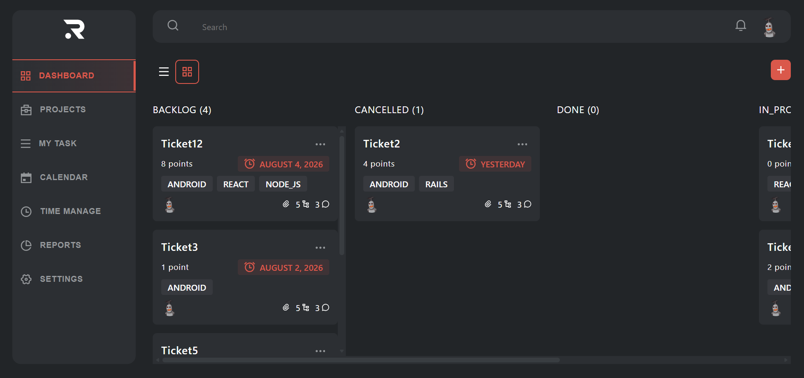
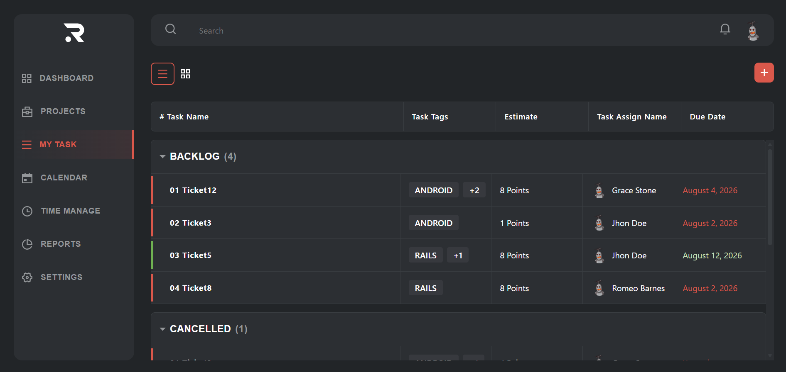

# Code Challenge

A task management dashboard built with React, TypeScript, and GraphQL. It includes a Kanban-style board grouped by task status and a "My Task" view with sortable/collapsible tables per status.


## Features

- Dashboard view with tasks grouped into columns by status
- My Task view with accordion tables grouped by status
- Create, edit, and delete tasks
- Loading skeletons for async states

### Dashboard



### My Task



## Tech stack

- **[React 19](https://react.dev/)** + **[TypeScript](https://www.typescriptlang.org/)**
- **[Vite](https://vite.dev/)** — dev server and build tool
- **[React Router](https://reactrouter.com/)** — routing
- **[Apollo Client](https://www.apollographql.com/docs/react)** — GraphQL client and cache
- **[GraphQL Code Generator](https://the-guild.dev/graphql/codegen)** — typed GraphQL operations
- **[Vitest](https://vitest.dev/)** + **[jsdom](https://github.com/jsdom/jsdom)** — unit testing
- **[ESLint](https://eslint.org/)** — linting

## Prerequisites

- [Node.js](https://nodejs.org/) (LTS recommended)
- A GraphQL API endpoint for the app to talk to (URI + token)

## Setup

1. Install dependencies:

   ```bash
   npm install
   ```

2. Create a `.env` file in the project root with the following variables:

   ```env
   VITE_GRAPHQL_URI=<your-graphql-endpoint>
   VITE_GRAPHQL_TOKEN=<your-graphql-token>
   ```

   If this is being read by a mentor, you're planning to run it locally and you don't have the token or URI, please ask me for it. You can also use the [hosted version](https://code-challenge-git-prod-emmanuel-martinez-ravn.vercel.app/dashboard/) of the app.

## Running the app

Start the dev server:

```bash
npm run dev
```

The app will be available at the URL printed in the terminal (default [http://localhost:5173](http://localhost:5173)).

## Other scripts

| Command              | Description                                         |
| -------------------- | --------------------------------------------------- |
| `npm run build`      | Type-checks and builds the app for production       |
| `npm run preview`    | Serves the production build locally                 |
| `npm run lint`       | Runs ESLint                                         |
| `npm run type-check` | Runs the TypeScript compiler without emitting files |
| `npm test`           | Runs the test suite with Vitest                     |
| `npm run codegen`    | Generates GraphQL types from `codegen.ts`           |

## Project structure

```
src/
├── app/            # App entry, providers (Apollo, Router), root component
├── core/           # Layout shell (header, sidebar, page layouts)
├── features/       # Feature/page modules (Dashboard, MyTask, ...)
├── graphql/         # Queries, mutations, and fragments
├── shared/         # Reusable components and pages shared across features
├── constants/       # Shared constants and utility functions
└── assets/         # Static assets
```

Path aliases (`@app`, `@core`, `@features`, `@shared`, `@constants`, `@graphql`, `@assets`) are configured in `vite.config.ts` and map to the folders above.

## Decisions and rationale

- This app was built using React 19 and TypeScript due to their popularity and the fact that I learned them in the past month trying to apply the best practices to a large codebase.
- This app uses [weserv](https://github.com/weserv/weserv) to proxy remote avatars, which is a free and open-source service that caches and proxies remote images to handle http errors.
- This app uses Apollo Client to fetch data from the GraphQL API due to its popularity and ease of use with the official Apollo Client Extension for VS Code to easily generate types and queries with introspection.
- The app was deployed to [Vercel](https://code-challenge-git-prod-emmanuel-martinez-ravn.vercel.app/dashboard/).
